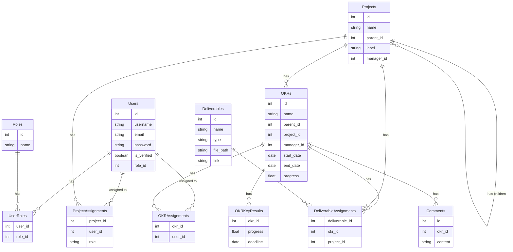

```mermaid
erDiagram
    Users {
        int id
        string username
        string email
        string password
        boolean is_verified
        int role_id
    }
    Roles {
        int id
        string name
    }
    Projects {
        int id
        string name
        int parent_id
        string label
        int manager_id
    }
    OKRs {
        int id
        string name
        int parent_id
        int project_id
        int manager_id
        date start_date
        date end_date
        float progress
    }
    UserRoles {
        int user_id
        int role_id
    }
    ProjectAssignments {
        int project_id
        int user_id
        string role
    }
    OKRAssignments {
        int okr_id
        int user_id
    }
    OKRKeyResults {
        int okr_id
        float progress
        date deadline
    }
    Comments {
        int id
        int okr_id
        string content
    }
    Deliverables {
        int id
        string name
        string type
        string file_path
        string link
    }
    DeliverableAssignments {
        int deliverable_id
        int okr_id
        int project_id
    }

    Users ||--o{ UserRoles : "has"
    Roles ||--o{ UserRoles : "has"
    Users ||--o{ ProjectAssignments : "assigned to"
    Projects ||--o{ ProjectAssignments : "has"
    Projects ||--o{ Projects : "has children"
    Projects ||--o{ OKRs : "has"
    Users ||--o{ OKRAssignments : "assigned to"
    OKRs ||--o{ OKRAssignments : "has"
    OKRs ||--o{ OKRKeyResults : "has"
    OKRs ||--o{ Comments : "has"
    OKRs ||--o{ DeliverableAssignments : "has"
    Projects ||--o{ DeliverableAssignments : "has"
    Deliverables ||--o{ DeliverableAssignments : "has"
```
